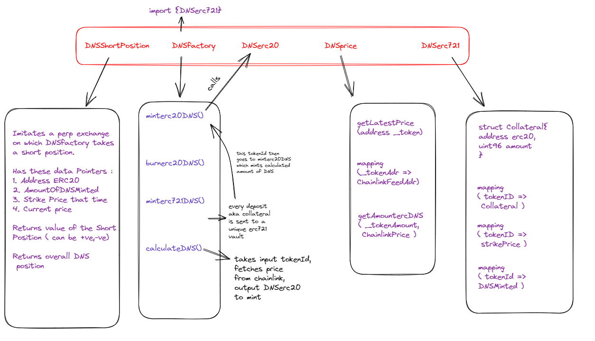

## Delta Neutral Stablecoin? WTF?

`Delta Neutral Stablecoin` is one of the very few elegant stablecoin design mechanisms in the crypto space right now. </br>
The UXD Stablecoin on Solana(now on EVM chains too?) is minted to the user after he deposits collateral amount X of an asset A</br>
and the protocol then opens a short position of corresponding amount X in a Derivative DEX.</br>
You see the Delta Neutral Nature yet Anon? </br>
Lets say the price at minting of the position was Y USD.

If the price of asset A increases by Z%. The PNL on the protocol amounts to X*(Y+ (ZY/100)) - X*(Y)
The PNL on the short position opened up amounts to -X*(ZY/100)
You add that up, you get 0


## Contracts

```ml

├─ DNSfactory.sol — Contract containing all core functions like minting DNS, burning DNS, etc.
├─ DNSerc20.sol   — Parent ERC20 contract of DNS stablecoin
├─ DNSerc721.sol  — Parent ERC721 contract minting positions/collateral locked by user
├─ DNScollateral.sol — Library containing relevant read-only storage pointers for DNSfactory
├─ DNSprice.sol —  Contract for interacting with Chainlink oracle

```

## Structure



## Tasks left
- [ ] Separate price getters function to DNSprice.sol
- [ ] Complete opening short position function
- [ ] Try to make the code as readable as possible
- [ ] Foundry tests bhai, foundry tests


